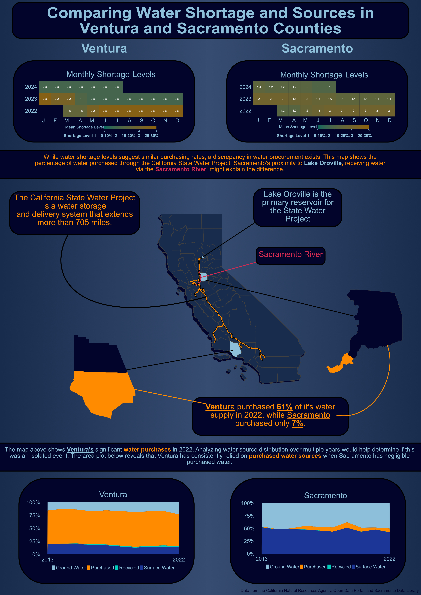

### Introduction

California is a diverse and beautiful state, however, it suffers from long periods of drought. Water is the most essential nutrient and unfortunately, it can be one of the most scarce. Understanding the distribution of water throughout the state is a key factor in assessing California's resiliency to drought. The data described in this analysis comes from the Department of Water Resources and the State Water Resources Control Board. It has been recently compiled by the California Water Data Consortium and posted on the California Natural Resource Agency Portal for open accessibility. From this data, I was interested in assessing the availability and allocation of water resources throughout districts. I chose to focus on Sacramento and Ventura counties because they represent two distinct latitudinal regions in California and had sufficient data for comparison.

### Infographic



### Design Element Choices

When creating any type of visualization, it is important to follow the 10 design elements. These elements were implemented into my visualization by the following:

-   **Graphic Form**: My infographic takes a straightforward graphic approach, featuring a heatmap, barplot, and area plot. The barplot stands out, as it represented by each county, with shading indicating the level of water shortage experienced in 2022.
-   **Text**: I built all of my data visualizations in R including the text for titles, axes, and legends. I had to repeatedly adjust the text size and export the file, as the visualizations appeared differently in R compared to Affinity Designer. The only text I added to the plot in Affinity was the percentage representation of the shortage level values.
-   **Themes**: The process of creating my themes were similar to that of the text. I had to make a lot of small changes, consisting of exporting my plots many times before I was happy. My goal was to create plots that allow the reader to easily view the overall trends without feeling overwhelmed. For instance, the area plots display only the starting and ending years to focus on the overall trend rather than comparing each individual year. In addition, I removed the tick marks on the x and y axes to maintain a cleaner, less cluttered appearance in the plots. I intended to keep the same minimalistic format for my heatmaps by not including a legend, but after feedback, I decided they were important.
-   **Color**: It was difficult for me to narrow down the color of my plots and the overall infographic. Originally, I wanted to use a tan color to represent a "dry desert" but shifted towards shades of blue for water. Initially, my plots only used these shades of blue. However, one of my peers suggested incorporating contrasting colors to highlight key points for the reader. For example, I used orange to display the percentage of water purchased, emphasizing the differences between Ventura and Sacramento counties.
-   **Typography**: I used ggplot2's default typeface Arial because of its clean and professional aesthetic.
-   **General Design**: I placed my figures and text inside rounded rectangles to create distinction within the visualization. To avoid clutter, I aimed to clearly define the differences between the information by grouping my three plots into their own sections.
-   **Contextualizing the data**: I added annotations and connected them to the relevant data using lines and color. The map features lines connecting the geospatial data to their corresponding annotations. Similarly, the most important information in the longer text is highlighted with color and boldness for emphasis.
-   **Centering the primary message**: The topic being addressed was placed at the top in big, bold letters for easy interpretation. The main takeaway from the infographic is that Ventura County purchases a significantly larger amount of water compared to Sacramento County. This message is highlighted through the use of contrasting colors, with orange set against blue.
-   **Considering accessibility**: I believe the color contrast is sufficient to ensure readability for individuals. The orange stands out against the dark blue, and the contrast between light and dark blues enhances readability. That being said, I did not consider a specific color blind palette as I wanted to keep the theme of water shortage throughout. So, the use of lines links related information, ensuring clarity and preventing confusion.
-   **DEI Lens**: My initial rendition may not have been fully inclusive for individuals with color blindness, as the information was not well connected. However, as mentioned above, my second version improves on this by better linking the elements, making the information accessible to all, including those with color blindness.

## Code used to create my infographic

### Load libraries

```{r}
#| code-fold: true
#| code-summary: Show the code

library(tidyverse)
library(here)
library(spnaf)
library(stringr)
library(ggExtra)
library(tmap)
library(sf)
library(janitor)
library(ggridges)
library(gridExtra)
```

### Load data

```{r}
#| code-fold: true
#| code-summary: Show the code

water_shortage <- read_csv(here("data", "actual_water_shortage_level.csv"))
five_year_shortage <- read_csv(here("data", "five_year_water_shortage_outlook.csv"))
historical_production <- read_csv(here("data", "historical_production_delivery.csv"))
population <- read_csv(here("data", "population_clean.csv"))
source_name <- read_csv(here("data", "source_name.csv"))

# Map boundary data
ca_counties <- st_read(here("data", "ca_counties", "CA_Counties.shp")) 
ca_boundary <- st_read(here("data", "ca_state", "CA_State.shp"))
project_line <- st_read(here("data", "i17_StateWaterProject_Centerline", "i17_StateWaterProject_Centerline.shp"))
California_Counties <- st_read(here("data", "California_Counties", "California_Counties.shp"))
ca_project <- st_read(here("data", "i17_StateWaterProject_ConstructionDivisions", "i17_StateWaterProject_ConstructionDivisions.shp"))
ca_lakes <- st_read(here("data", "California_Lakes", "California_Lakes.shp"))
ca_state_project <- st_read(here("data", "i17_StateWaterProject_Repayment_Reaches", "i17_StateWaterProject_Repayment_Reaches.shp"))
ca_rivers <- st_read(here("data", "Rivers", "Rivers.shp"))
```

### Heatmaps for Ventura and Sacramento Counties

```{r}
#| code-fold: true
#| code-summary: Show the code


# Filter water shortage level for the following districts by org_id
level_month <- water_shortage %>% 
  filter(org_id %in% c(376, 2158, 2629, 2631, 372, 2132, 2140, 2683, 2130)) %>% 
  
  # Create a new county column by using stringr library
  mutate(county = case_when(
    str_detect(supplier_name, fixed("ventura", ignore_case = TRUE)) ~ "Ventura",
    str_detect(supplier_name, fixed("sacramento", ignore_case = TRUE)) ~ "Sacramento",
    TRUE ~ "other"
  )) %>% 
  
  # Filter out NA values for shortage level
  filter(!is.na(state_standard_shortage_level)) %>% 
  
  # Create year and month columns
  mutate(year = year(start_date),
         month = month(start_date)) %>% 
  
  # Group by for aggregating the mean
  group_by(county, year, month) %>% 
  
  # Summarise the mean for the county, year, and month
  summarise(mean_level = mean(state_standard_shortage_level))


# Create a df for only Ventura 
vent_level_month <- level_month %>% 
  filter(county == "Ventura")

# Create a df for only Sacramento
sac_level_month <- level_month %>% 
  filter(county == "Sacramento")

# Plot the Ventura data
vent_monthly <- ggplot(vent_level_month, aes(x = factor(month), y = factor(year), fill = mean_level)) +
  geom_tile() +
  
  # Add the values for each tile
  geom_text(aes(label = round(mean_level, 1)), color = "white", size = 8) +
  
  # Changes the months from numbers to their abbreviations for x-axis
  scale_x_discrete(name = "month", labels = c("1" = "J", "2" = "F", "3" = "M", "4" = "A", "5" = "M", "6" = "J", "7" = "J", "8" = "A", "9" = "S", "10" = "O", "11" = "N", "12" = "D")) +
  
  # Color range for the values
  scale_fill_continuous(low = "#01665D", high = "#8C6009", limits = c(0, 3)) +
  
  # Add title
  labs(title = "Monthly Shortage Levels",
       fill = "Mean Shortage Level") +
  
  # Fix the tiles to be squares 
  coord_fixed(ratio = 1) + 
  
  # Theme for image export 
  theme_minimal() +
  theme(
    plot.title = element_text(size = rel(6), color = "#8EBFDA", hjust = 0.5),
    axis.text.x = element_text(hjust = 1, size = rel(5), colour = "#8EBFDA"),  # Rotate x-axis labels for better readability
    axis.title.x = element_blank(),  # Remove x-axis title
    axis.title.y = element_blank(),  # Remove y-axis title
    axis.text.y = element_text(size = rel(5), color = "#8EBFDA"),  # Adjust size of y-axis labels if needed
    axis.ticks = element_blank(),  # Remove axis ticks
    panel.grid = element_blank(),  # Remove gridlines
    panel.background = element_blank(),
    plot.background = element_rect(fill  = "#02042C"),
    plot.margin = margin(0,0,0,0),
    legend.position = "bottom",
    legend.key.height = unit(1, "cm"),  # Elongate the gradient (height)
    legend.key.width = unit(3, "cm"),   # Elongate the gradient (width)
    legend.text = element_text(size = rel(2), color = "#8EBFDA"),
    legend.title = element_text(size = rel(3), color = "#8EBFDA", vjust = 1)
  )


# Plot the Sacramento Data
sac_monthly <- ggplot(sac_level_month, aes(x = factor(month), y = factor(year), fill = mean_level)) +
  geom_tile() +
  
  # Add the values for each tile
  geom_text(aes(label = round(mean_level, 1)), color = "white", size = 8) +
  
   # Changes the months from numbers to their abbreviations for x-axis
  scale_x_discrete(name = "month", labels = c("1" = "J", "2" = "F", "3" = "M", "4" = "A", "5" = "M", "6" = "J", "7" = "J", "8" = "A", "9" = "S", "10" = "O", "11" = "N", "12" = "D")) +
  
  # Color range for the values
  scale_fill_continuous(low = "#01665D", high = "#8C6009", limits = c(0, 3)) +
  
  # Add title
  labs(title = "Monthly Shortage Levels",
       fill = "Mean Shortage Level") +
  
  # Fix the tiles to be squares
  coord_fixed(ratio = 1) +  # Make tiles square
  
  # Theme for image export 
  theme_minimal() +
  theme(
    plot.title = element_text(size = rel(6), color = "#8EBFDA", hjust = 0.5),
    axis.text.x = element_text(hjust = 1, size = rel(5), colour = "#8EBFDA"),  # Rotate x-axis labels for better readability
    axis.title.x = element_blank(),  # Remove x-axis title
    axis.title.y = element_blank(),  # Remove y-axis title
    axis.text.y = element_text(size = rel(5), color = "#8EBFDA"),  # Adjust size of y-axis labels if needed
    axis.ticks = element_blank(),  # Remove axis ticks
    panel.grid = element_blank(),  # Remove gridlines
    panel.background = element_blank(),
    plot.background = element_rect(fill  = "#02042C"),
    plot.margin = margin(0,0,0,0),
    legend.position = "bottom",
    legend.key.height = unit(1, "cm"),  # Elongate the gradient (height)
    legend.key.width = unit(3, "cm"),   # Elongate the gradient (width)
    legend.text = element_text(size = rel(2), color = "#8EBFDA"),
    legend.title = element_text(size = rel(3), color = "#8EBFDA", vjust = 1)
  )

ggsave("sac_monthly.pdf", plot = sac_monthly, width = 18, height = 9, dpi = 300)

ggsave("vent_monthly.pdf", plot = vent_monthly, width = 18, height = 9, dpi = 300)
```

### Geospatial Data Cleaning for Map

```{r}
#| code-fold: true
#| code-summary: Show the code

# Filter to Lake Oroville
ca_oroville <- ca_lakes %>% 
  filter(NAME == "Lake Oroville") %>% 
  st_drop_geometry() %>% 
  st_as_sf(coords = c("LON_NAD83", "LAT_NAD83"))

# Filter counties to Ventura and Sacramento
ca_counties <- ca_counties %>% 
  clean_names() %>% 
  mutate(color = case_when(
    name == "Ventura" ~ "#8EBFDA", # Color for Ventura county 
    name == "Sacramento" ~ "#8EBFDA", # Color for Sacramento County 
    TRUE ~ "#182C4D" # Color for all other counties
  )) 

# Filter to Sacramento River
ca_sac_amer_river <- ca_rivers %>% 
  filter(NAME == "Sacramento")

# Transform geospatial data to the same CRS
ca_boundary <- st_transform(ca_boundary, crs = 4326)
ca_counties <- st_transform(ca_counties, crs = 4326)
ca_oroville <- st_transform(ca_oroville, crs = 4326)
ca_sac_amer_river <- st_transform(ca_sac_amer_river, crs = 4326)
```

### Plotting Statem Map and Individual Counties

```{r}
#| code-fold: true
#| code-summary: Show the code

# Plot the State Map 
cali_map <- tm_shape(ca_boundary) + # State boundary data
  tm_borders() +
  
  # County data
    tm_shape(ca_counties) +
  tm_polygons(fill = "color") +
  tm_layout(frame = FALSE) +
  
  # Adding the State Water Project Line
  tm_shape(ca_state_project) +
  
  # Bolding our orange line
    tm_lines(col = "black", 
           lwd = 3) +
  
  # Line we want to see 
    tm_lines(col = "darkorange",
           lwd = 1.5) +
  
  # Add Lake Oroville 
  tm_shape(ca_oroville) +
  tm_dots(fill = "black", size = 0.55) +
  tm_dots(fill  = "red", size = 0.3) +
  
  # Add Sacramento River
  tm_shape(ca_sac_amer_river) +
  tm_lines(col = "black", lwd = 3) +
  tm_lines(col = "#D42B53", lwd = 1.5)
  


# Filter for the individual county

# Sacramento county 
sac_df <- ca_counties %>% 
  filter(name == "Sacramento")

# Plot 
sac_map <- tm_shape(sac_df) + 
  tm_polygons(fill = "#02042C") +
  tm_layout(frame = FALSE)

# Ventura County 
vent_df <- ca_counties %>% 
  filter(name == "Ventura")

# Plot
vent_map <- tm_shape(vent_df) + 
  tm_polygons(fill = "#02042C") +
  tm_layout(frame = FALSE)

# tmap_save(cali_map, "cali_map.pdf", width = 8, height = 10, dpi = 300, bg = "transparent")
```

### Sacramento Area Plot

```{r}
#| code-fold: true
#| code-summary: Show the code

# Filter the historical production data
hist_sac <- historical_production %>%
  
  # Filter to org_id related to Sacramento and Ventura
  filter(org_id %in% c(376, 2158, 2629, 2631, 372, 2132, 2140, 2683, 2130, 495, 1057, 890, 2469, 433),
         !is.na(quantity_acre_feet),
         
         # Interested in the water produced 
         water_produced_or_delivered == "water produced",
         
         # Values are negligible 
         !water_type %in% c("non-potable (total excluded recycled)", "non-potable water sold to another pws", "sold to another pws")) %>%
  
    # Categorize org_id into different their respective counties
    mutate(county = case_when(
    org_id %in% c(376, 2158, 2629, 2631, 495, 1057, 890, 2469, 433) ~ "Ventura",
    org_id %in% c(372, 2132, 2140, 2683, 2130) ~ "Sacramento",
    TRUE ~ "other"
  )) %>%
  
  # Group to month, water type and county
  group_by(start_date, water_produced_or_delivered, water_type, county) %>% 
  
  # Calculate total quantity for group above
  summarise(quantity = sum(quantity_acre_feet)) %>% 
  
  ungroup() %>% 
  
  # Create new column year 
  mutate(year = year(start_date)) %>% 
  
  # Group for aggregation 
  group_by(year, county, water_type) %>% 
  
  # Summarize information by year
  summarise(quantity = sum(quantity)) %>% 
  
  group_by(year, county) %>% 
  
  # Calculate proportions and percentages for each water type
  mutate(total_quantity = sum(quantity),
         proportion = quantity / total_quantity,
         percent = proportion * 100) %>% 
  ungroup() %>% 
  
  # Filter to only Sacramento
  filter(county == "Sacramento")


# Plot 
area_sac <- ggplot(hist_sac, aes(x = year, y = percent, fill = water_type)) + 
  geom_area() +
  
  # Minimlize x-axis scale 
  scale_x_continuous(breaks = c(2013,2022)) +
  
  # Add percentage to y-axis
  scale_y_continuous(labels = scales::label_percent(scale = 1)) +
  
  # Manually fill colors and change legend names
  scale_fill_manual(values = c("#8EBFDA", "darkorange", "#00CEBC", "#1C3698"),
                    labels = c("groundwater wells" = "Ground Water",
                               "purchased or received from another pws" = "Purchased", 
                               "recycled" = "Recycled",
                               "surface water" = "Surface Water")) +
  
  # Add labels 
  labs(x = element_blank(),
       y = element_blank(),
       title = "Sacramento") +
  
  # Add theme arguments 
  theme_minimal() +
  
  theme(
    
    # Move legend to the bottom
    legend.position = "bottom",
    
    # Adjust title 
    plot.title = element_text(size = rel(6), color = "#8EBFDA", hjust = 0.5),
    #strip.text = element_text(size = rel(3.5), color = "#8EBFDA"),
    
    # Adjust x-axis text 
    axis.text.x = element_text(hjust = 0.5, size = rel(5)),
    
    # Adjust y-axis size 
    axis.text.y = element_text(size = rel(5)),
    
    # Add background color to plot 
    plot.background = element_rect(fill = "#02042C"),
    
    # Get rid of ticks
    axis.ticks = element_blank(),
    
    # Change x-axis text 
    axis.text.x.bottom = element_text(color = "#8EBFDA"),
    
    # Change y-axis text 
    axis.text.y.left = element_text(color = "#8EBFDA"),
    
    # Get rid of panel grid 
    panel.grid = element_blank(),
    legend.text = element_text(color = "#8EBFDA", size = rel(3.5)),
    legend.title = element_blank(),
    panel.border = element_blank(),
    legend.key.height = unit(1, "cm"),
   legend.key.width = unit(1,"cm")
    
  ) 


# ggsave("area_sac.pdf", plot = area_sac, width = 18, height = 9, dpi = 300)
```

### Ventura Area Plot

```{r}
#| code-fold: true
#| code-summary: Show the code

# Same code as above but filter to Ventura at the end
hist_ventura <- historical_production %>%
  filter(org_id %in% c(376, 2158, 2629, 2631, 372, 2132, 2140, 2683, 2130, 495, 1057, 890, 2469, 433),
         !is.na(quantity_acre_feet),
         water_produced_or_delivered == "water produced",
         !water_type %in% c("non-potable (total excluded recycled)", "non-potable water sold to another pws", "sold to another pws")) %>%
    mutate(county = case_when(
    org_id %in% c(376, 2158, 2629, 2631, 495, 1057, 890, 2469, 433) ~ "Ventura",
    org_id %in% c(372, 2132, 2140, 2683, 2130) ~ "Sacramento",
    TRUE ~ "other"
  )) %>%
  group_by(start_date, water_produced_or_delivered, water_type, county) %>% 
  summarise(quantity = sum(quantity_acre_feet)) %>% 
  ungroup() %>% 
  mutate(year = year(start_date)) %>% 
  group_by(year, county, water_type) %>% 
  summarise(quantity = sum(quantity)) %>% 
  group_by(year, county) %>% 
  mutate(total_quantity = sum(quantity),
         proportion = quantity / total_quantity,
         percent = proportion * 100) %>% 
  ungroup() %>% 
  filter(county == "Ventura")


# Plot for Ventura
# Code same as Sacramento 
area_ventura <- ggplot(hist_ventura, aes(x = year, y = percent, fill = water_type)) + 
  geom_area() +
  scale_x_continuous(breaks = c(2013,2022)) +
  scale_y_continuous(labels = scales::label_percent(scale = 1)) +
  scale_fill_manual(values = c("#8EBFDA", "darkorange", "#00CEBC", "#1C3698"),
                    labels = c("groundwater wells" = "Ground Water",
                               "purchased or received from another pws" = "Purchased", 
                               "recycled" = "Recycled",
                               "surface water" = "Surface Water")) +
  labs(x = element_blank(),
       y = element_blank(),
       title = "Ventura") +
  theme_minimal() +
  theme(
    legend.position = "bottom",
    plot.title = element_text(size = rel(6), color = "#8EBFDA", hjust = 0.5),
   # strip.text = element_text(size = rel(3.5), color = "#8EBFDA"),
    axis.text.x = element_text(hjust = 0.5, size = rel(5)),
    axis.text.y = element_text(size = rel(5)),
    plot.background = element_rect(fill = "#02042C"),
    #axis.ticks.x = element_blank(),
    axis.ticks = element_blank(),
    axis.text.x.bottom = element_text(color = "#8EBFDA"),
    axis.text.y.left = element_text(color = "#8EBFDA"),
    panel.grid = element_blank(),
    legend.text = element_text(color = "#8EBFDA", size = rel(3.5)),
    legend.title = element_blank(),
   legend.key.height = unit(1, "cm"),
   legend.key.width = unit(1,"cm")
  )

# ggsave("area_ventura.pdf", plot = area_ventura, width = 18, height = 9, dpi = 300)
```

### Calculating 2022 Water Type Percentages

```{r}
#| code-fold: true
#| code-summary: Show the code

# Filter data to 
historical_filter2 <- historical_production %>%
  filter(org_id %in% c(376, 2158, 2629, 2631, 372, 2132, 2140, 2683, 2130, 495, 1057, 890, 2469, 433),
         !is.na(quantity_acre_feet),
         water_produced_or_delivered == "water produced",
         !water_type %in% c("non-potable (total excluded recycled)", "non-potable water sold to another pws", "sold to another pws")) %>%
    mutate(county = case_when(
    org_id %in% c(376, 2158, 2629, 2631, 495, 1057, 890, 2469, 433) ~ "Ventura",
    org_id %in% c(372, 2132, 2140, 2683, 2130) ~ "Sacramento",
    TRUE ~ "other"
  )) %>%
  group_by(start_date, water_produced_or_delivered, water_type, county) %>% 
  summarise(quantity = sum(quantity_acre_feet)) %>% 
  ungroup() %>% 
  mutate(year = year(start_date)) %>% 
  group_by(year, county, water_type) %>% 
  summarise(quantity = sum(quantity)) %>% 
  group_by(year, county) %>% 
  mutate(total_quantity = sum(quantity),
         proportion = quantity / total_quantity,
         percentage = proportion * 100) %>% 
  ungroup()

proportions_2024 <- historical_filter2 %>% 
  filter(year == 2022) %>% 
  group_by(county, water_type) %>% 
  summarise(quantity) %>% 
  ungroup() %>% 
  group_by(county) %>% 
  mutate(percentage = quantity / sum(quantity) * 100) %>% 
  ungroup()
```
