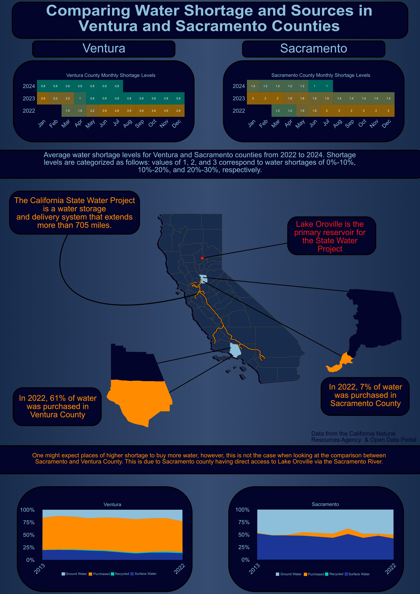

### Part 1: Introduction

California is a diverse and beautiful state, however, it suffers from long periods of drought. Water is the most essential nutrient and unfortunately, it can be one of the most scarce. Understanding the distribution of water throughout the state is a key factor in assessing California's resiliency to drought. The data described in this analysis comes from the Department of Water Resources and the State Water Resources Control Board. It has been recently compiled by the California Water Data Consortium and posted on the California Natural Resource Agency Portal for open accessibility. From this data, I was interested in assessing the availability and allocation of water resources throughout districts. In order to craft an interesting and engaging infographic for the viewer, I had I decided to choose a comparison between two counties, Sacramento and Ventura. Initially, I wanted to compare counties more north and south of the ones chosen, however these were contained a significant amount of data for analysis.

### Part 2: Infographic



### Part 3: Design Elements

When creating any type of visualization, it is important to follow the 10 design elements. These elements were implemented into my visualization by the following:

-   Graphic Form: One of the most essential questions for creating an infographic is: what type of graphic form should I use? My infographic contains more of a basic graphic form. I created a heatmap, barplot, and an area plot. The only one that has a little twist is that my barplot is actually represented by the county I am referring to, with the shading representing the amount of water shortage that county experienced during 2022.
-   Text: The text of all my plots most definitely had to be tampered with. There is a major difference of what text looks like in R and when you export that plot. Everything may look great in R, but may look entirely different in another software such as Affinity. I had to do a lot of changing and exporting of my plots until I found the variations that I liked the most.
-   Themes: The process of creating my themes were similar to that of the text. I had to make a lot of small changes before I was satisfied. For my infographic, I wanted to make minimalistic plots for the reader to easily interpret my data. If I needed to add anything such as notations to the plot, I wanted to do that in Affinity. To create, a minimalistic plot, I had to add a several arguments to the themes.
-   Color: I went back and forth on the color of my plots and the overall infographic. I initially wanted to do a tan color to represent a dry desert but shifted towards shades of blue to represent water. I was then told it might be good to add some contrast to my infographic, so I changed some of the blue colors to orange.
-   Typography: The typography of my infographic was standard as there was no changes needed because I wanted to keep a professional tone.
-   General Design: I put my figures and text inside rounded rectangles to add distinction within the visualization. It can be easy to get cluttered, so I wanted to define the differences between my information.
-   Contextualizing the data: I added annotations that was linked to the proper data through use of arrows and color coordination.
-   Centering the primary message: The primary question was made clear by putting it at the type in big text. The main message I tried highlighting in the color orange which contrasted with the blues.
-   Considering accessibility: I beleive that there is enough contrast in the colors so those that are colorblind may easily read the information present. The orange color pops on the dark blue and I think the contrast of light and dark blue is easy to read.
-   DEI Lens: My DEI lens focused on creating an accessible visualization for everyone by implementation of colors and design. I wanted to be inclusive of those that are colorblind. If this project narrowed down to individual communities, then I could incorporate data that was representative of these communities.

#### Code used to create my infographic

#### Load libraries

```{r}
#| code-fold: true
#| code-summary: Show the code

library(tidyverse)
library(here)
library(spnaf)
library(stringr)
library(ggExtra)
library(tmap)
library(sf)
library(janitor)
library(ggridges)
library(gridExtra)
```

#### Load data

```{r}
#| code-fold: true
#| code-summary: Show the code

water_shortage <- read_csv(here("data", "actual_water_shortage_level.csv"))
five_year_shortage <- read_csv(here("data", "five_year_water_shortage_outlook.csv"))
historical_production <- read_csv(here("data", "historical_production_delivery.csv"))
population <- read_csv(here("data", "population_clean.csv"))
source_name <- read_csv(here("data", "source_name.csv"))

# Map boundary data
ca_counties <- st_read(here("data", "ca_counties", "CA_Counties.shp")) 
ca_boundary <- st_read(here("data", "ca_state", "CA_State.shp"))
project_line <- st_read(here("data", "i17_StateWaterProject_Centerline", "i17_StateWaterProject_Centerline.shp"))
California_Counties <- st_read(here("data", "California_Counties", "California_Counties.shp"))
ca_project <- st_read(here("data", "i17_StateWaterProject_ConstructionDivisions", "i17_StateWaterProject_ConstructionDivisions.shp"))
```

#### Code for the heatmap plot

```{r}
#| code-fold: true
#| code-summary: Show the code


# Filter water shortage level for the following districts by org_id
level_month <- water_shortage %>% 
  filter(org_id %in% c(376, 2158, 2629, 2631, 372, 2132, 2140, 2683, 2130)) %>% 
  
  # Create a new county column by using stringr library
  mutate(county = case_when(
    str_detect(supplier_name, fixed("ventura", ignore_case = TRUE)) ~ "Ventura",
    str_detect(supplier_name, fixed("sacramento", ignore_case = TRUE)) ~ "Sacramento",
    TRUE ~ "other"
  )) %>% 
  
  # Filter out NA values for shortage level
  filter(!is.na(state_standard_shortage_level)) %>% 
  
  # Create year and month columns
  mutate(year = year(start_date),
         month = month(start_date)) %>% 
  
  # Group by for aggregating the mean
  group_by(county, year, month) %>% 
  
  # Summarise the mean for the county, year, and month
  summarise(mean_level = mean(state_standard_shortage_level))


# Create a df for only Ventura 
vent_level_month <- level_month %>% 
  filter(county == "Ventura")

# Create a df for only Sacramento
sac_level_month <- level_month %>% 
  filter(county == "Sacramento")

# Plot the Ventura data
vent_monthly <- ggplot(vent_level_month, aes(x = factor(month), y = factor(year), fill = mean_level)) +
  geom_tile() +
  
  # Add the values for each tile
  geom_text(aes(label = round(mean_level, 1)), color = "white", size = 8) +
  
  # Changes the months from numbers to their abbreviations for x-axis
  scale_x_discrete(name = "month", labels = c("1" = "Jan", "2" = "Feb", "3" = "Mar", "4" = "Apr", "5" = "May", "6" = "Jun", "7" = "Jul", "8" = "Aug", "9" = "Sep", "10" = "Oct", "11" = "Nov", "12" = "Dec")) +
  
  # Color range for the values
  scale_fill_continuous(low = "#01665D", high = "#8C6009") +
  
  # Add title
  labs(title = "Ventura County Monthly Shortage Levels") +
  
  # Fix the tiles to be squares 
  coord_fixed(ratio = 1) + 
  
  # Theme for image export 
  theme_minimal() +
  theme(
    plot.title = element_text(size = rel(3.5), color = "#8EBFDA", hjust = 0.5),
    axis.text.x = element_text(angle = 45, hjust = 1, size = rel(5), colour = "#8EBFDA"),  # Rotate x-axis labels for better readability
    axis.title.x = element_blank(),  # Remove x-axis title
    axis.title.y = element_blank(),  # Remove y-axis title
    axis.text.y = element_text(size = rel(5), color = "#8EBFDA"),  # Adjust size of y-axis labels if needed
    axis.ticks = element_blank(),  # Remove axis ticks
    panel.grid = element_blank(),  # Remove gridlines
    panel.background = element_blank(),
    plot.background = element_rect(fill  = "#02042C"),
    plot.margin = margin(0,0,0,0),
    legend.position = "none"
  )


# Plot the Sacramento Data
sac_monthly <- ggplot(sac_level_month, aes(x = factor(month), y = factor(year), fill = mean_level)) +
  geom_tile() +
  
  # Add the values for each tile
  geom_text(aes(label = round(mean_level, 1)), color = "white", size = 8) +
  
   # Changes the months from numbers to their abbreviations for x-axis
  scale_x_discrete(name = "month", labels = c("1" = "Jan", "2" = "Feb", "3" = "Mar", "4" = "Apr", "5" = "May", "6" = "Jun", "7" = "Jul", "8" = "Aug", "9" = "Sep", "10" = "Oct", "11" = "Nov", "12" = "Dec")) +
  
  # Color range for the values
  scale_fill_continuous(low = "#01665D", high = "#8C6009") +
  
  # Add title
  labs(title = "Sacramento County Monthly Shortage Levels") +
  
  # Fix the tiles to be squares
  coord_fixed(ratio = 1) +  # Make tiles square
  
  # Theme for image export 
  theme_minimal() +
  theme(
    plot.title = element_text(size = rel(3.5), color = "#8EBFDA", hjust = 0.5),
    axis.text.x = element_text(angle = 45, hjust = 1, size = rel(5), colour = "#8EBFDA"),  # Rotate x-axis labels for better readability
    axis.title.x = element_blank(),  # Remove x-axis title
    axis.title.y = element_blank(),  # Remove y-axis title
    axis.text.y = element_text(size = rel(5), color = "#8EBFDA"),  # Adjust size of y-axis labels if needed
    axis.ticks = element_blank(),  # Remove axis ticks
    panel.grid = element_blank(),  # Remove gridlines
    panel.background = element_blank(),
    plot.background = element_rect(fill  = "#02042C"),
    plot.margin = margin(0,0,0,0),
    legend.position = "none"
  )
```

#### Creating the map from the geospatial data

```{r}
#| code-fold: true
#| code-summary: Show the code

# Filter the geospatial data to plot county
ca_counties <- ca_counties %>% 
  clean_names() %>% 
  mutate(color = case_when(
    name == "Ventura" ~ "#8EBFDA", # Color for Ventura county 
    name == "Sacramento" ~ "#8EBFDA", # Color for Sacramento County 
    TRUE ~ "#182C4D" # Color for all other counties
  )) 

# Plot our map 
cali_map <- tm_shape(ca_boundary) + # State boundary data
  tm_borders() +
  
  # County data
    tm_shape(ca_counties) +
  tm_polygons(fill = "color") +
  tm_layout(frame = FALSE) +
  
  # Adding the State Water Project Line
  tm_shape(ca_project) +
  
  # Bolding our orange line
    tm_lines(col = "black", 
           lwd = 3) +
  
  # Line we want to see 
    tm_lines(col = "darkorange",
           lwd = 1.5)


# Filter for the individual county

# Sacramento county 
sac_df <- ca_counties %>% 
  filter(name == "Sacramento")

# Plot 
sac_map <- tm_shape(sac_df) + 
  tm_polygons(fill = "#02042C") +
  tm_layout(frame = FALSE)

# Ventura County 
vent_df <- ca_counties %>% 
  filter(name == "Ventura")

# Plot
vent_map <- tm_shape(vent_df) + 
  tm_polygons(fill = "#02042C") +
  tm_layout(frame = FALSE)
```

#### Code for the area plots

```{r}
#| code-fold: true
#| code-summary: Show the code

# Filter the historical production data
hist_sac <- historical_production %>%
  
  # Filter to org_id related to Sacramento and Ventura
  filter(org_id %in% c(376, 2158, 2629, 2631, 372, 2132, 2140, 2683, 2130, 495, 1057, 890, 2469, 433),
         !is.na(quantity_acre_feet),
         
         # Interested in the water produced 
         water_produced_or_delivered == "water produced",
         
         # Values are negligible 
         !water_type %in% c("non-potable (total excluded recycled)", "non-potable water sold to another pws", "sold to another pws")) %>%
  
    # Categorize org_id into different their respective counties
    mutate(county = case_when(
    org_id %in% c(376, 2158, 2629, 2631, 495, 1057, 890, 2469, 433) ~ "Ventura",
    org_id %in% c(372, 2132, 2140, 2683, 2130) ~ "Sacramento",
    TRUE ~ "other"
  )) %>%
  
  # Group to month, water type and county
  group_by(start_date, water_produced_or_delivered, water_type, county) %>% 
  
  # Calculate total quantity for group above
  summarise(quantity = sum(quantity_acre_feet)) %>% 
  
  ungroup() %>% 
  
  # Create new column year 
  mutate(year = year(start_date)) %>% 
  
  # Group for aggregation 
  group_by(year, county, water_type) %>% 
  
  # Summarize information by year
  summarise(quantity = sum(quantity)) %>% 
  
  group_by(year, county) %>% 
  
  # Calculate proportions and percentages for each water type
  mutate(total_quantity = sum(quantity),
         proportion = quantity / total_quantity,
         percent = proportion * 100) %>% 
  ungroup() %>% 
  
  # Filter to only Sacramento
  filter(county == "Sacramento")


# Plot 
area_sac <- ggplot(hist_sac, aes(x = year, y = percent, fill = water_type)) + 
  geom_area() +
  facet_wrap(~county, scales = "free", ncol = 1) +
  
  # Minimlize x-axis scale 
  scale_x_continuous(breaks = c(2013,2022)) +
  
  # Add percentage to y-axis
  scale_y_continuous(labels = scales::label_percent(scale = 1)) +
  
  # Manually fill colors and change legend names
  scale_fill_manual(values = c("#8EBFDA", "darkorange", "#00CEBC", "#1C3698"),
                    labels = c("groundwater wells" = "Ground Water",
                               "purchased or received from another pws" = "Purchased", 
                               "recycled" = "Recycled",
                               "surface water" = "Surface Water")) +
  
  # Add labels 
  labs(x = element_blank(),
       y = element_blank(),
       title = "Sacramento") +
  
  # Add theme arguments 
  theme_minimal() +
  
  theme(
    
    # Move legend to the bottom
    legend.position = "bottom",
    
    # Adjust title 
    strip.text = element_text(size = rel(3.5), color = "#8EBFDA"),
    
    # Adjust x-axis text 
    axis.text.x = element_text(angle = 45, hjust = 1, size = rel(5)),
    
    # Adjust y-axis size 
    axis.text.y = element_text(size = rel(5)),
    
    # Add background color to plot 
    plot.background = element_rect(fill = "#02042C"),
    
    # Get rid of ticks
    axis.ticks = element_blank(),
    
    # Change x-axis text 
    axis.text.x.bottom = element_text(color = "#8EBFDA"),
    
    # Change y-axis text 
    axis.text.y.left = element_text(color = "#8EBFDA"),
    
    # Get rid of panel grid 
    panel.grid = element_blank(),
    legend.text = element_text(color = "#8EBFDA"),
    legend.title = element_blank(),
    panel.border = element_blank()
    
  ) 
```

```{r}
#| code-fold: true
#| code-summary: Show the code

# Same code as above but filter to Ventura at the end
hist_ventura <- historical_production %>%
  filter(org_id %in% c(376, 2158, 2629, 2631, 372, 2132, 2140, 2683, 2130, 495, 1057, 890, 2469, 433),
         !is.na(quantity_acre_feet),
         water_produced_or_delivered == "water produced",
         !water_type %in% c("non-potable (total excluded recycled)", "non-potable water sold to another pws", "sold to another pws")) %>%
    mutate(county = case_when(
    org_id %in% c(376, 2158, 2629, 2631, 495, 1057, 890, 2469, 433) ~ "Ventura",
    org_id %in% c(372, 2132, 2140, 2683, 2130) ~ "Sacramento",
    TRUE ~ "other"
  )) %>%
  group_by(start_date, water_produced_or_delivered, water_type, county) %>% 
  summarise(quantity = sum(quantity_acre_feet)) %>% 
  ungroup() %>% 
  mutate(year = year(start_date)) %>% 
  group_by(year, county, water_type) %>% 
  summarise(quantity = sum(quantity)) %>% 
  group_by(year, county) %>% 
  mutate(total_quantity = sum(quantity),
         proportion = quantity / total_quantity,
         percent = proportion * 100) %>% 
  ungroup() %>% 
  filter(county == "Ventura")


# Plot for Ventura
# Code same as Sacramento 
area_ventura <- ggplot(hist_ventura, aes(x = year, y = percent, fill = water_type)) + 
  geom_area() +
  facet_wrap(~county, scales = "free", ncol = 1) +
  scale_x_continuous(breaks = c(2013,2022)) +
  scale_y_continuous(labels = scales::label_percent(scale = 1)) +
  scale_fill_manual(values = c("#8EBFDA", "darkorange", "#00CEBC", "#1C3698"),
                    labels = c("groundwater wells" = "Ground Water",
                               "purchased or received from another pws" = "Purchased", 
                               "recycled" = "Recycled",
                               "surface water" = "Surface Water")) +
  labs(x = element_blank(),
       y = element_blank()) +
  theme_minimal() +
  theme(
    legend.position = "bottom",
    strip.text = element_text(size = rel(3.5), color = "#8EBFDA"),
    axis.text.x = element_text(angle = 45, hjust = 1, size = rel(5)),
    axis.text.y = element_text(size = rel(5)),
    plot.background = element_rect(fill = "#02042C"),
    #axis.ticks.x = element_blank(),
    axis.ticks = element_blank(),
    axis.text.x.bottom = element_text(color = "#8EBFDA"),
    axis.text.y.left = element_text(color = "#8EBFDA"),
    panel.grid = element_blank(),
    legend.text = element_text(color = "#8EBFDA"),
    legend.title = element_blank()
  )
```
